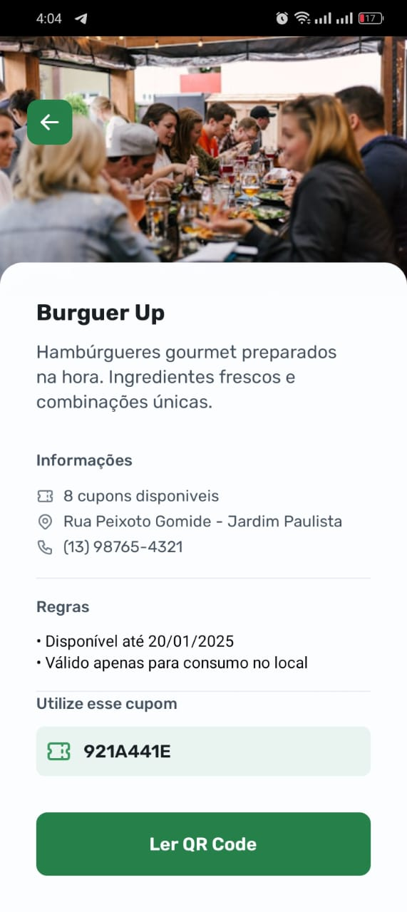
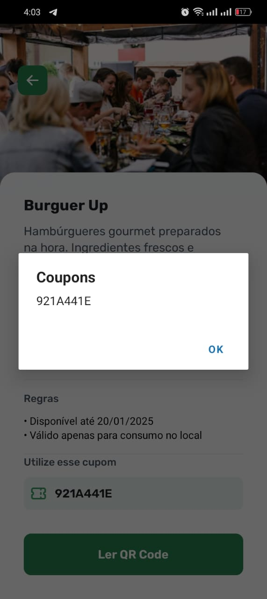

[TYPESCRIPT__BADGE]: https://img.shields.io/badge/typescript-D4FAFF?style=for-the-badge&logo=typescript
[REACT_NATIVE]:https://img.shields.io/badge/react_native-%2320232a.svg?style=for-the-badge&logo=react&logoColor=%2361DAFB
[ANDROID_BADGE]:https://img.shields.io/badge/Android-3DDC84?style=for-the-badge&logo=android&logoColor=white
[iOS_BADGE]:https://img.shields.io/badge/iOS-000000?style=for-the-badge&logo=ios&logoColor=white

<h1 align="center" style="font-weight: bold;">Nearby - Your Favorite Mobile Club Benefits App  💻</h1>

![React Native][REACT_NATIVE]
![typescript][TYPESCRIPT__BADGE]
![Android][ANDROID_BADGE]
![IOS][iOS_BADGE]

`Content:`
<p align="center">
 <a href="#about">About</a>  •
 <a href="#features">Features</a>  •
 <a href="#techs">Technologies</a>  •
 <a href="#figma">Figma</a>  •
 <a href="#howToRun">How To Clone & Run</a> •
 <a href="#results">Results</a>  •
 <a href="#contribute">Contributes</a>  •
 <a href="#collaborators">Collaborators</a> •
 <a href="#license">License</a> •
</p>


<p align="center">
    
</p>

<h2 id="started">📌 About</h2>

Nearby is a mobile app developed during the NLW Pocket Mobile event, hosted by Rocketseat. This project aims to provide users with a unique experience, granting access to discount coupons for use at nearby establishments.

<h2 id="features">Features</h2>

- Benefits Exploration: View available discount coupons and benefits for nearby establishments.

- QRCode Scanning: Use your device's camera to scan QRCodes and redeem coupons easily and securely.

- Interactive Map: Find nearby establishments through an integrated dynamic map.

- Bottom Sheet: Modern and interactive interface for displaying details and additional options.

<h2 id="techs">Technologies Used</h2>

- The app was developed using the following technologies and concepts:

- [React Native](https://reactnative.dev/docs/set-up-your-environment): Framework for mobile development.

- [Expo](https://docs.expo.dev/get-started/set-up-your-environment/): Framework and platform for facilitating the development and deployment of React Native applications.

- TypeScript: Language with static typing for greater security and productivity in development.

- StyleSheet: Styling of components based on React Native.

- Expo Router: File-based navigation to simplify app routing.

- API Integration: Backend integration with Node.js for coupon retrieval and validation.

- QRCode Scanning: Implementation of QRCode reading using the device's camera.

- Map Display: Use of maps to show the location of participating establishments.


<h2 id="started">🚀 Getting started</h2>

This section describes how to run the project locally.


<h2 id="figma">🔗 Figma</h2>

<a> href="https://www.figma.com/community/file/1448070647757721748">NLW Pocket MObile - Nearby</a>

<h2 id="howToRun">🔗 How to Clone & Run</h2>

1. Clone this repository:

```bash
git clone https://github.com/EriveltoSilva/nearby-mobile.git
```
or in linux:
```bash
git clone git@github.com:EriveltoSilva/nearby-mobile.git
```

2. Navigate to the project directory:

```bash
cd  nearby-mobile
```

3. Navigate to the project api directory:

```bash
cd  api
```

3.1. Install the api dependencies:

```bash
npm install
```

3.2. Install the api dependencies:

```bash
npm run start
```

4. Open a new terminal

5. Going back to main project directory:

```bash
cd ..
```

6. Install api dependencies  mobile project:

```bash
npm install
```

7. Change api ip address in application:
    - 7.1. Open file in `src/utils/config.ts`
    - 7.2. Change `API_ENDPOINT` value to your respective IP address

8. Start the Expo server

```bash
npx expo start
```

9. Use app


<h2 id="results">🤝 Results</h2>

<p align="center">
    
    
    
    
    
    
    
    
    
</p>

<h2 id="contribute">📫 Contribute</h2>

To contribute to this project, follow these steps:

1. `git clone https://github.com/EriveltoSilva/portfolio`
2. `git checkout -b feature/NAME`
3. Follow commit patterns
4. Open a Pull Request explaining the problem solved or feature made. If applicable, include screenshots of visual modifications and wait for the review!


<h2 id="collaborators">🤝 Collaborators</h2>

Special thank you for all people that contributed for this project.

<table>
  <tr>
    <td align="center">
      <a href="#">
        <br>
        <sub>
          <b>Erivelto Silva</b>
        </sub>
      </a>
    </td>
  </tr>
</table>


<h2 id="license">License</h2>

This project is licensed under the <a href="./LICENSE">MIT License</a>. See the LICENSE file for more information.

